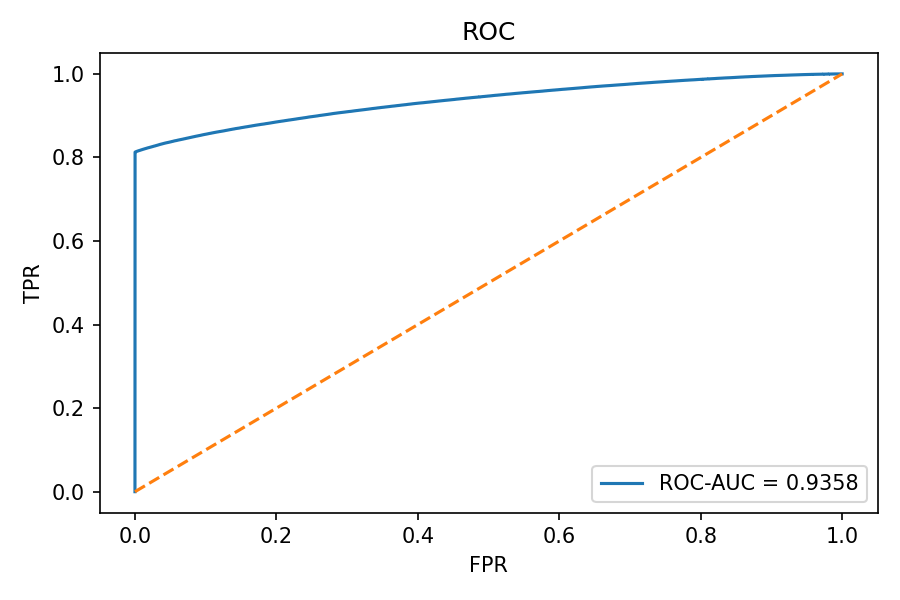
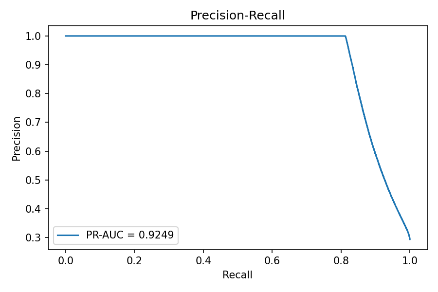
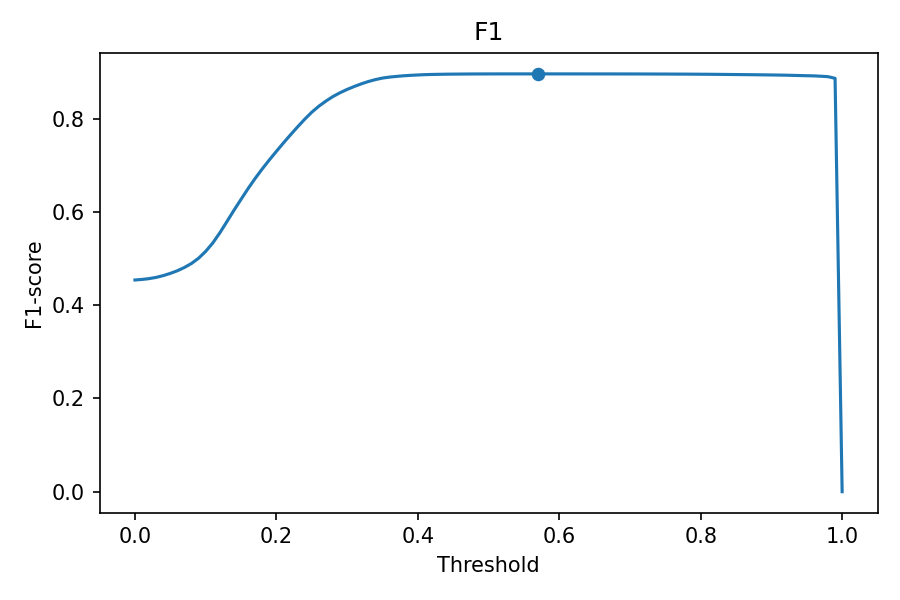

# kaggle_a_dengi
В соревновании необходимо было обучить модель, которая сможет предсказывать **отток клиентов** на основе их кредитной истории, финансовых показателей и поведенческих признаков.  
Задача — на каждый `loan_id` из тестового набора данных предсказать **1 (отток)** или **0 (не отток)**.

## Структура репозитория
```
kaggle_a_dengi/
├─ notebooks/
│ ├─ a_dengi_final.ipynb
│ └─ img/
│   ├─ roc_curve.png
│   ├─ pr_curve.png
│   └─ f1.png
├─ data/
│ └─ README.md
├─ models/
│ └─ catboost_best_model.cbm
├─ requirements.txt
├─ README.md
├─ .gitignore
└─ LICENCE
```

## Запуск
1. Установить зависимости
    ```
   pip install -r requirements.txt
2. Открыть ноутбук
      ```
      jupyter notebook notebooks/a_dengi_final.ipynb

3. Выполните ячейки последовательно

    - загрузка данных
    
    - обработка пропусков и категориальных признаков
    
    - генерация фичей
    
    - обучение CatBoostClassifier
    
    - подбор гиперпараметров через GridSearchCV
    
    - поиск оптимального порога threshold по метрике F1
  
## Требования
```
python=3.11
pandas
numpy
matplotlib
scikit-learn
catboost
rapidfuzz
```
  
## Этапы работ

1. **Загрузка и первичная обработка**

     - Загрузка датасетов

     - Проверка типов данных, оптимизация памяти с помощью astype

     - Преобразование дат в timestamp

2. **Работа с пропусками**

     - Заполнение медианой или групповой медианой.

     - Признаки без данных заполнены нулями.

3. **Feature Engineering**
   
     - Преобразование регионов с помощью fuzzy matching (rapidfuzz), чтобы нормализовать значения городов.

     - Генерация новых признаков:

          - payment_to_income_ratio — отношение платежа к доходу.

          - overdue_ratio — доля просроченных платежей.

          - approval_ratio — отношение одобренной суммы к запрошенной.

          - risk_score — агрегированный риск.

          - total_debt_burden, disposable_income_ratio — оценка долговой нагрузки.

          - Группировка по client_id для извлечения агрегированных метрик (avg_approved_amount, total_loans, total_contacts и др.).

4. **Моделирование**

   - Использован GridSearchCV с 3-фолд кросс-валидацией

   - Целевая метрика — F1-score.

   - Основная модель: `CatBoostClassifier`.

   - Разделение на train/test с фиксированным `seed` для воспроизводимости.

5. **Подбор порога**

   После обучения подобран оптимальный threshold:
```
best F1(valid) = 0.8965 @ thr = 0.57
```

## Результаты

Ниже — графики ROC, PR, F1

Численные значения метрик вынесены в легенды:

**Графики ROC, PR, F1**

<p align="center">
  
  
  
</p>

<div align="center">
  <table>
    <thead>
      <tr><th>class</th><th>precision</th><th>recall</th><th>f1-score</th><th>support</th></tr>
    </thead>
    <tbody>
      <tr><td>0</td><td>0.9276</td><td>0.9999</td><td>0.9624</td><td>570016</td></tr>
      <tr><td>1</td><td>0.9998</td><td>0.8126</td><td>0.8965</td><td>237226</td></tr>
      <tr><td>accuracy</td><td></td><td></td><td>0.9449</td><td>807242</td></tr>
      <tr><td>macro avg</td><td>0.9637</td><td>0.9062</td><td>0.9295</td><td>807242</td></tr>
      <tr><td>weighted avg</td><td>0.9488</td><td>0.9449</td><td>0.9430</td><td>807242</td></tr>
    </tbody>
  </table>
</div>
