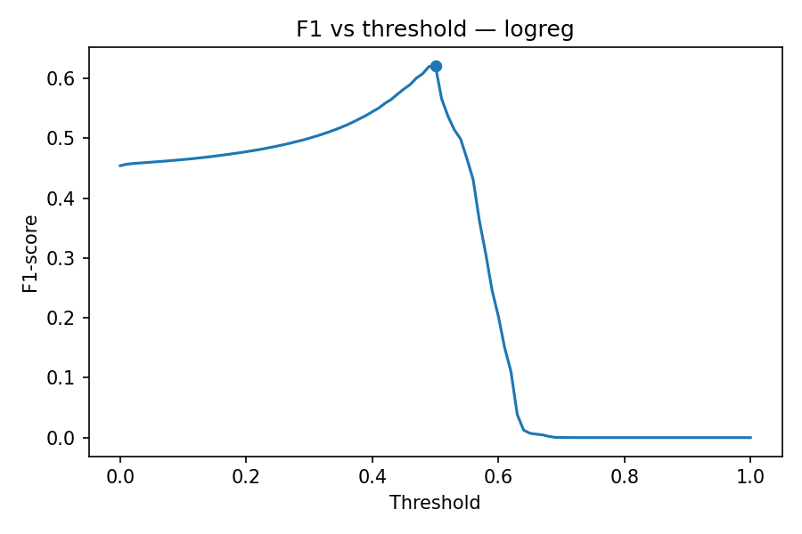
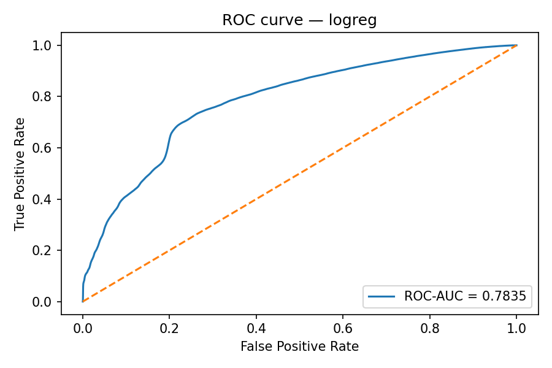
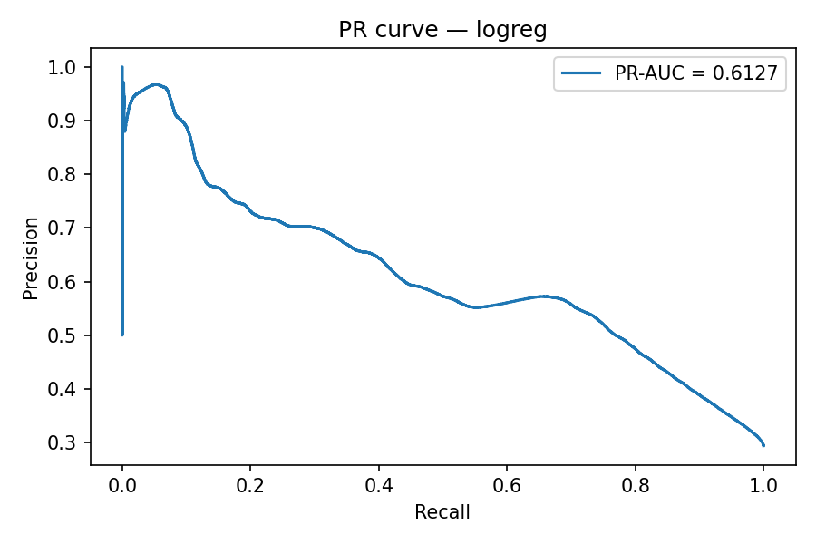
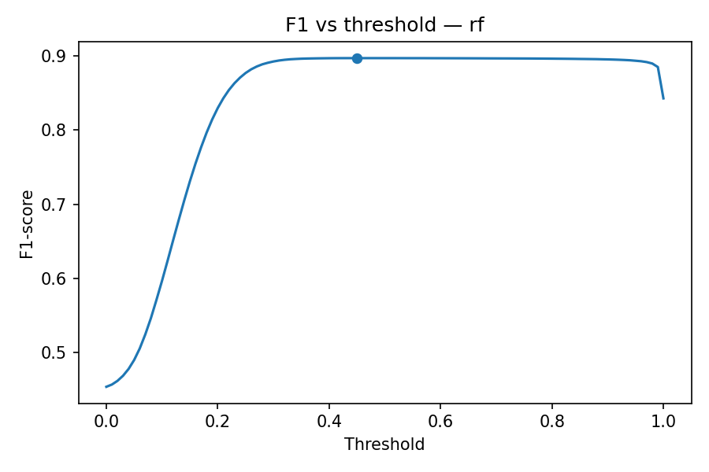
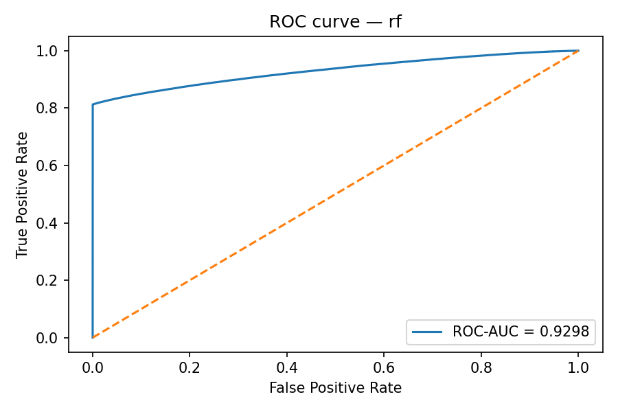
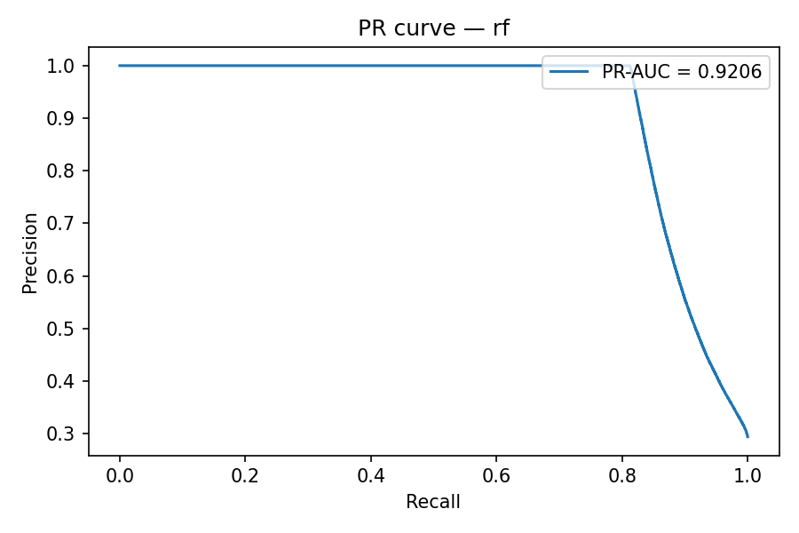
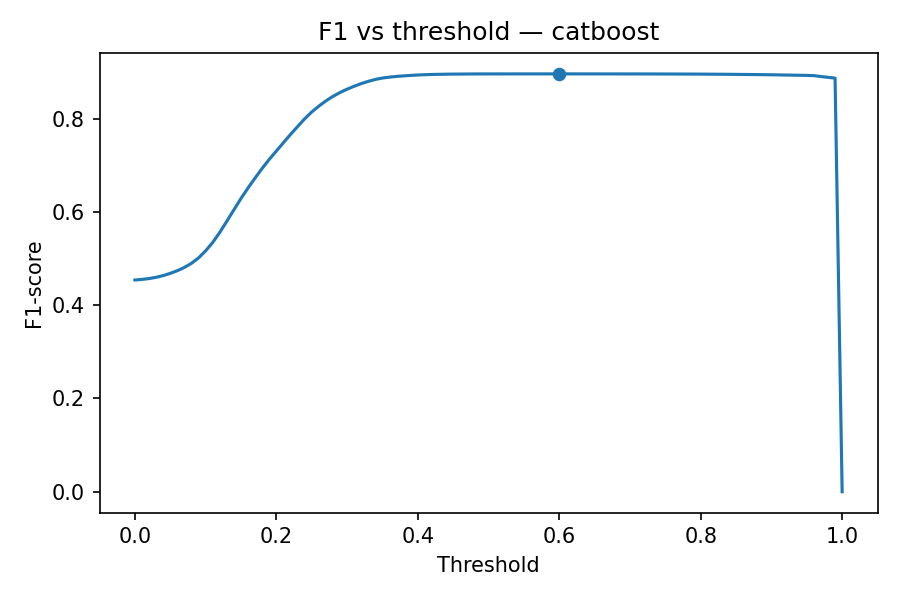
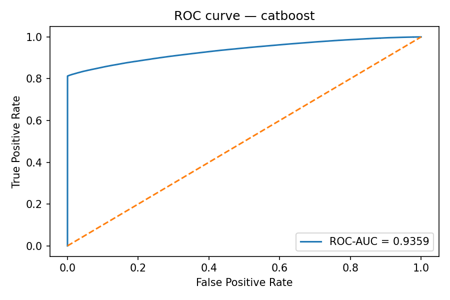
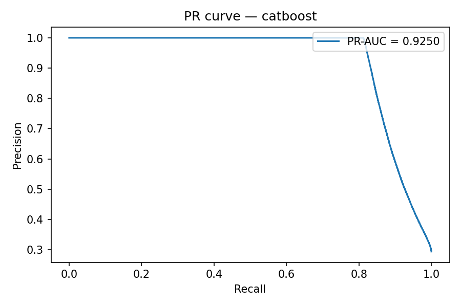

# kaggle_a_dengi
В соревновании необходимо было обучить модель, которая сможет предсказывать **отток клиентов** на основе их кредитной истории, финансовых показателей и поведенческих признаков.  
Задача — на каждый `loan_id` из тестового набора данных предсказать **1 (отток)** или **0 (не отток)**.

## Структура репозитория
```
kaggle_a_dengi/
├─ notebooks/
│ ├─ a_dengi_final.ipynb
│ └─ img/
│   ├─ catboost_f1.png
│   ├─ catboost_pr.png
│   ├─ catboost_roc.png
│   ├─ logreg_f1.png
│   ├─ logreg_pr.png
│   ├─ logreg_roc.png
│   ├─ rf_f1.png
│   ├─ rf_pr.png
│   └─ rf_roc.png
├─ data/
│ └─ README.md
├─ models/
│ ├─ logreg.pkl
│ └─ catboost.cbm
├─ requirements.txt
├─ README.md
├─ .gitignore
└─ LICENCE
```

## Запуск
1. Установить зависимости
    ```
   pip install -r requirements.txt
2. Открыть ноутбук
      ```
      jupyter notebook notebooks/a_dengi_final.ipynb
      ```
3. Выполните ячейки последовательно

    - загрузка данных

    - обработка пропусков и категориальных признаков

    - генерация фичей

    - обучение трёх бейзлайнов (LogisticRegression, RandomForest, CatBoost)

    - подбор гиперпараметров через Hyperopt

    - поиск оптимального порога threshold по метрике F1

    - сравнение моделей, сохранение графиков
  
  
## Этапы работ

1. **Загрузка и первичная обработка**

     - Загрузка датасетов

     - Проверка типов данных, оптимизация памяти с помощью astype

     - Преобразование дат в timestamp

2. **Работа с пропусками**

     - Заполнение медианой или групповой медианой.

     - Признаки без данных заполнены нулями.

3. **Feature Engineering**
   
     - Преобразование регионов с помощью fuzzy matching (rapidfuzz), чтобы нормализовать значения городов.

     - Генерация новых признаков:

          - payment_to_income_ratio — отношение платежа к доходу.

          - overdue_ratio — доля просроченных платежей.

          - approval_ratio — отношение одобренной суммы к запрошенной.

          - risk_score — агрегированный риск.

          - total_debt_burden, disposable_income_ratio — оценка долговой нагрузки.

          - Группировка по client_id для извлечения агрегированных метрик (avg_approved_amount, total_loans, total_contacts и др.).


4. **Моделирование**

    Обучены три бейзлайна:

    - LogisticRegression — линейная базовая модель (solver saga, подбор регуляризации через Hyperopt).

    - RandomForestClassifier — случайный лес с подбором глубины, числа деревьев, max_features и других гиперпараметров.

    - CatBoostClassifier — градиентный бустинг по деревьям, подбор гиперпараметров (iterations, depth, learning_rate, l2_leaf_reg и других) через Hyperopt.

    Для всех моделей выполнялся подбор оптимального порога F1 на валидационной выборке (train_test_split с зафиксированным сидом).

## Результаты

Ниже — графики ROC, PR, F1 для всех моделей

Численные значения метрик вынесены в легенды:

### **Логистическая регрессия**

<p align="center">
  
  
  
</p>

<div align="center">
  <table border="1" class="dataframe">
  <thead>
    <tr style="text-align: right;">
      <th>model</th>
      <th>precision</th>
      <th>recall</th>
      <th>f1</th>
      <th>roc_auc</th>
      <th>pr_auc</th>
      <th>best_thr</th>
    </tr>
  </thead>
  <tbody>
    <tr>
      <td>logreg</td>
      <td>0.562</td>
      <td>0.6943</td>
      <td>0.6212</td>
      <td>0.7835</td>
      <td>0.6127</td>
      <td>0.5</td>
    </tr>
  </tbody>
</table>
</div>

### **Случайный лес**

<p align="center">
  
  
  
</p>

<div align="center">
  <table border="1" class="dataframe">
    <thead>
      <tr style="text-align: right;">
        <th>model</th>
        <th>precision</th>
        <th>recall</th>
        <th>f1</th>
        <th>roc_auc</th>
        <th>pr_auc</th>
        <th>best_thr</th>
      </tr>
    </thead>
    <tbody>
      <tr>
        <td>random_forest</td>
        <td>0.9999</td>
        <td>0.8123</td>
        <td>0.8964</td>
        <td>0.9298</td>
        <td>0.9206</td>
        <td>0.45</td>
      </tr>
    </tbody>
  </table>
</div>


### **Catboost Classifier**

<p align="center">
  
  
  
</p>

<div align="center">
    <table border="1" class="dataframe">
      <thead>
        <tr style="text-align: right;">
          <th>model</th>
          <th>precision</th>
          <th>recall</th>
          <th>f1</th>
          <th>roc_auc</th>
          <th>pr_auc</th>
          <th>best_thr</th>
        </tr>
      </thead>
      <tbody>
        <tr>
          <td>catboost</td>
          <td>0.9998</td>
          <td>0.8126</td>
          <td>0.8965</td>
          <td>0.9359</td>
          <td>0.925</td>
          <td>0.6</td>
        </tr>
      </tbody>
    </table>
</div>
    
## **Итоги**

- Проведено сравнение трёх моделей на задаче бинарной классификации оттока клиентов:
  
  <div align="center">
  <table border="1" class="dataframe">
    <thead>
      <tr style="text-align: center;">
        <th>model</th>
        <th>precision</th>
        <th>recall</th>
        <th>f1</th>
        <th>roc_auc</th>
        <th>pr_auc</th>
        <th>best_thr</th>
      </tr>
    </thead>
    <tbody>
      <tr>
        <td>LogReg</td>
        <td>0.5620</td>
        <td>0.6943</td>
        <td>0.6212</td>
        <td>0.7835</td>
        <td>0.6127</td>
        <td>0.50</td>
      </tr>
      <tr>
        <td>Random Forest</td>
        <td>0.9999</td>
        <td>0.8123</td>
        <td>0.8964</td>
        <td>0.9298</td>
        <td>0.9206</td>
        <td>0.45</td>
      </tr>
      <tr>
        <td>Catboost</td>
        <td>0.9998</td>
        <td>0.8126</td>
        <td>0.8965</td>
        <td>0.9359</td>
        <td>0.9250</td>
        <td>0.60</td>
      </tr>
    </tbody>
  </table>
</div>

- CatBoostClassifier показал наилучший баланс качества и устойчивости:
  ```    
  best F1 = 0.8965, thr = 0.60
  ROC-AUC = 0.9359, PR-AUC = 0.925
  ```
- Модель сохранена в models/catboost.cbm и готова для применения на тестовом наборе данных соревнования.

